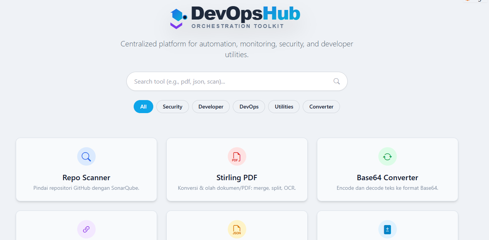

# DevOps Tools Hub



A comprehensive, **All-in-One** web application designed for DevOps Engineers and Developers. This platform centralizes essential utilities, security scanners, and automation tools into a single, modern interface, streamlining your daily workflows.

## ✨ Key Features

### 🛡️ Security & Access
*   **Repo Scanner (SonarQube)**: Run static code analysis on Git repositories with customizable exclusions/inclusions and quality gate checks.
*   **SSL Checker**: Analyze SSL/TLS certificates, expiry dates, and security grades.
*   **GitHub Access Manager**: Verify and manage user permissions/roles across GitHub repositories and organizations.
*   **Security Utilities**:
    *   **Password Generator**: Create strong, customizable passwords.
    *   **Hash Generator**: Generate MD5, SHA1, SHA256, SHA512, and Bcrypt hashes.
    *   **JWT Debugger**: Decode and inspect JSON Web Tokens (offline).

### 🛠️ Developer Utilities
*   **Code Formatters & Linters**:
    *   **JSON Formatter**: Beautify, minify, and validate JSON.
    *   **SQL Formatter**: Format SQL queries for better readability.
    *   **YAML Linter**: Validate and auto-fix YAML syntax.
    *   **HTML Viewer**: Render and inspect HTML snippets.
*   **Comparators**:
    *   **Diff Checker**: Compare text or code side-by-side to identify differences.
    *   **Regex Tester**: Test regular expressions against text patterns in real-time.

### 🔄 Converters & Calculators
*   **Data Converters**:
    *   **Base64**: Encode and decode strings.
    *   **URL Encoder**: Safe URL encoding/decoding.
    *   **JSON Converters**: Convert JSON to Go Structs, C# Classes, SQL Schema, or YAML.
*   **Calculators**:
    *   **IP Calculator**: Subnetting helper (CIDR, Netmask, Broadcast).
    *   **Chmod Calculator**: Visual permissions calculator for Linux (chmod).
    *   **Time Converter**: Convert Epoch/Unix timestamps to human-readable dates and vice-versa.

### ⚙️ DevOps Automation
*   **Dockerfile Generator**: Create optimized Dockerfiles for various language stacks (Node, Python, Go, etc.).
*   **Crontab Generator**: Visual editor for scheduling cron jobs.
*   **Integrations** (Optional):
    *   **Repo Automation**: Redirect to internal workflow/helm automation tools.
    *   **Stirling PDF**: Integration for PDF manipulation (Merge, Split, OCR).
    *   **File Compressor**: Link to file compression microservices.

---

## 🚀 Installation & Deployment

### Prerequisites
*   **Docker** or **Podman** (Recommended)
*   *Alternatively*: Python 3.12+ and Node.js (for local dev)

### Option A: Using Podman / Docker (Fastest)

1.  **Clone the Repository**
    ```bash
    git clone https://github.com/username/devops-tools-hub.git
    cd devops-tools-hub
    ```

2.  **Configure Environment**
    ```bash
    cp .env-example .env
    # Edit .env to set your secrets and preferences
    ```

3.  **Build and Run**
    *Using Podman:*
    ```bash
    podman build -t devops-tools-hub .
    podman run -d \
      --name devops-tools-hub \
      -p 5000:5000 \
      --env-file .env \
      -v "$(pwd)/static/screenshots:/app/static/screenshots" \
      devops-tools-hub
    ```

    *Using Docker Compose:*
    ```bash
    docker-compose up -d --build
    ```

    Access the app at `http://localhost:5000`.

### Option B: Manual Local Installation

1.  **Set up Python Environment**
    ```bash
    python -m venv venv
    source venv/bin/activate  # On Windows: venv\Scripts\activate
    pip install -r requirements.txt
    ```

2.  **Install Playwright Browsers** (Required for Screenshots)
    ```bash
    playwright install chromium
    ```

3.  **Run the Application**
    ```bash
    python run.py
    ```

---

## 🔧 Configuration (.env)

The application is highly configurable via environment variables.

### Core Settings
| Variable | Description | Default |
| :--- | :--- | :--- |
| `FLASK_SECRET_KEY` | **Required**. Secret key for session security. | *Random if missing* |
| `LOG_LEVEL` | Logging verbosity (`DEBUG`, `INFO`, `WARNING`). | `INFO` |
| `PORT` | Port to run the Flask app on (Manual run only). | `5000` |

### SonarQube Scanner
| Variable | Description |
| :--- | :--- |
| `SONAR_HOST_URL` | URL of your SonarQube server. |
| `SONAR_LOGIN_TOKEN` | Authentication token for the scanner. |
| `SONAR_EXCLUSIONS` | Default file patterns to exclude from scans. |

### Feature Toggles & Integrations
Enable or disable specific features to tailor the hub to your needs.

| Variable | Description | Default |
| :--- | :--- | :--- |
| `ENABLE_REPO_SCANNER` | Enable SonarQube scanner interface. | `true` |
| `ENABLE_STIRLING_PDF` | Enable PDF tools link. | `true` |
| `STIRLING_STUDIO_URL` | URL for the external Stirling PDF service. | - |
| `ENABLE_REPO_AUTOMATION`| Enable Repo Automation link. | `true` |
| `REPO_AUTOMATION_FE_URL`| URL for the external Automation service. | - |

### UI Customization (White Labeling)
Make the tool look like your own corporate portal.
*   `APP_TITLE`: "My Company DevOps Hub"
*   `APP_LOGO`: URL or path to your logo.
*   `APP_FAVICON`: URL or path to your favicon.

---

## 📂 Project Structure

```plaintext
devops-tools-hub/
├── app/
│   ├── routes/         # Route definitions (Repo Scan, GitHub Access, Tools)
│   ├── utils/          # Core logic (Git/Sonar, SSL, Linters, Validators)
│   ├── config.py       # Configuration management (Environment variables)
│   ├── tasks.py        # Background task management
│   └── __init__.py     # App factory and logging setup
├── static/
│   ├── css/            # UI Styling (Bootstrap, CodeMirror, Custom)
│   ├── js/             # Client-side scripts (Scanner, Theme, Axios)
│   ├── images/         # Static assets (Logos, Icons)
│   └── screenshots/    # Scan results storage (persistent volume)
├── templates/
│   ├── repo-scan/      # SonarQube Scanner interface
│   ├── github-access/  # GitHub permission management
│   ├── tools/          # Utility tool templates (Regex, SSL, etc.)
│   ├── json-formatter/ # JSON specific transformation tools
│   ├── layout.html     # Base layout template
│   └── ...             # Other tool-specific folders (Crontab, Diff, etc.)
├── Dockerfile          # Containerization configuration
├── docker-compose.yml  # Multi-container orchestration
├── requirements.txt    # Python dependencies
└── run.py              # Application entry point
```

## 📄 License

This project is open-source and available under the **MIT License**.
